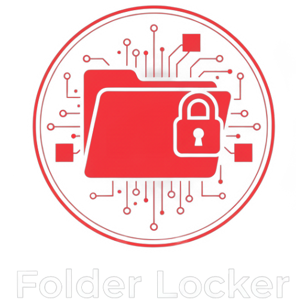
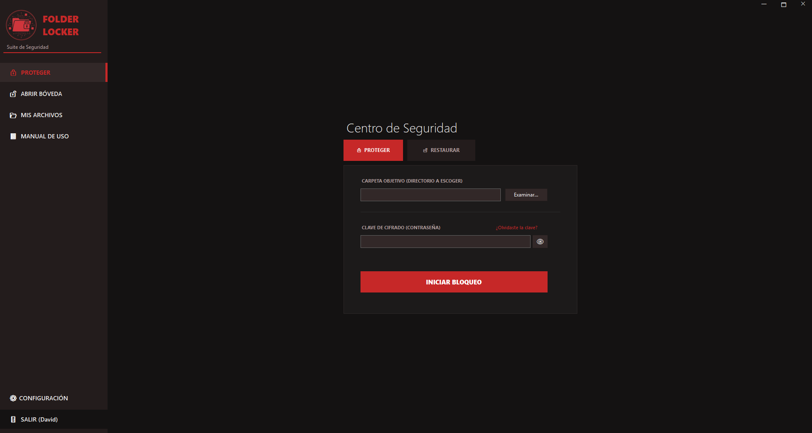
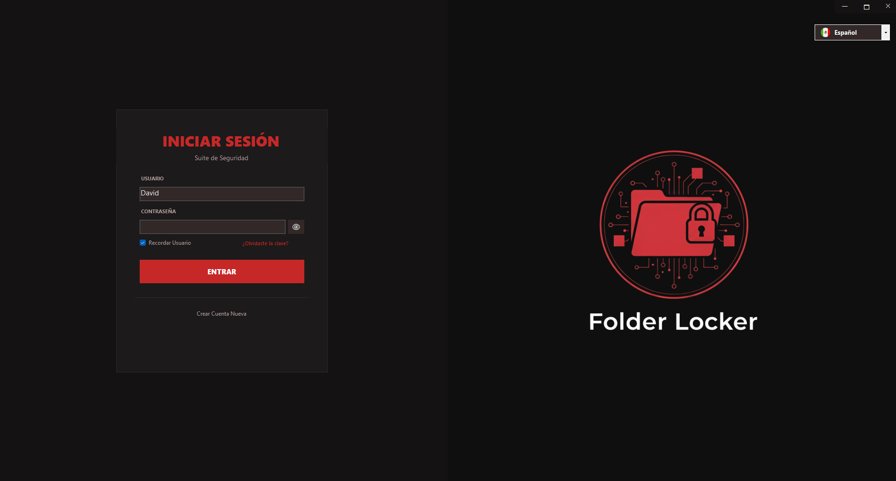
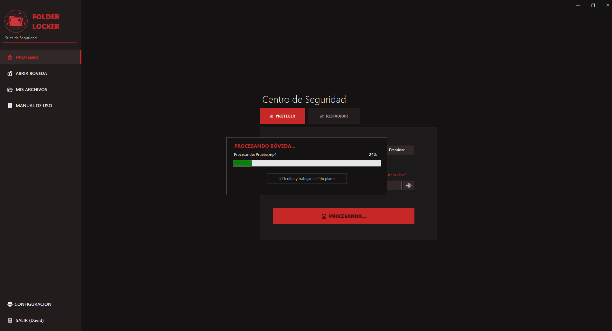
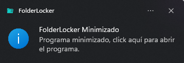

    

# `>_` FolderLocker Security Suite

**Suite de Seguridad "Zero-Knowledge" de Grado Empresarial para Windows. Virtualiza, bloquea y desaparece tus archivos.**

 

| 🛡️ | **Nueva Versión v5.0:** | *Ahora con Arquitectura "Stealth" e Integración Nativa con Dokan Driver.*   ¡Descarga el instalador abajo! |
|--|-------------|:---------------------------------------------------------------------------------------------------------------------------------------------------------------|

 

    

---

    
Desplegar Tabla de Contenidos

    
 
        
- [Propósito](#-propósito)
- [Capturas de Pantalla](#-capturas-de-pantalla)
- [Descarga](#-descarga)
- [Características](#-características)
- [Arquitectura](#-arquitectura)
- [Instalación](#-instalación)
- [Contribuciones](#-contribuciones)
- [Créditos](#-créditos)

---

## `>_` Propósito

FolderLocker ha sido desarrollado con el objetivo de proporcionar una herramienta potente y centrada en la **privacidad absoluta** para usuarios de Windows. A diferencia de los ocultadores de carpetas tradicionales (que solo cambian atributos), esta suite utiliza un **Driver de Sistema de Archivos Virtual (Dokan)** para encriptar los datos al vuelo.

Esta aplicación está diseñada para **seguridad real**. Si la bóveda no está montada, tus archivos son matemáticamente inaccesibles e invisibles en el disco físico.

**Casos de Uso Principales:**
- **Privacidad Personal:** Mantén fotos, documentos y videos lejos de miradas indiscretas.
- **Transporte de Datos:** Crea bóvedas portátiles que solo se pueden abrir con tus credenciales.
- **Protección Antirrobo:** Incluso si roban tu disco duro, los nombres de archivos y contenidos permanecen ofuscados (GUIDs ilegibles).

> [!Caution]
> **Aviso de Pérdida de Datos:**  
> FolderLocker utiliza encriptación AES-256 y SHA-256 de grado militar. Si pierdes tu Contraseña Maestra Y tu Código de Recuperación, **tus datos se perderán matemáticamente para siempre**. No existen "puertas traseras" (backdoors).

---

## `>_` 📱 Capturas de Pantalla

     
    <table>
        <tr>
            <td align="center">
                <strong>Explorador Virtual Seguro (M:)</strong> 
                
            </td>
            <td align="center">
                <strong>Control de Acceso</strong> 
                
            </td>
        </tr>
        <tr>
            <td align="center">
                <strong>Visualización de Procesos</strong> 
                
            </td>
            <td align="center">
                <strong>Notificación Sigilosa</strong> 
                
            </td>
        </tr>
    </table>
     

---

## `>_` ⬇️ Descarga

Descarga el último archivo `installer.exe` directamente desde la página de lanzamientos (Releases):

  

---

## `>_` Características

- **Arquitectura "Stealth":** Los nombres de archivo se ofuscan en el disco físico (se convierten en GUIDs aleatorios).
- **Encriptación On-The-Fly:** Los archivos se descifran en la memoria RAM solo cuando los solicitas. Nada se guarda en texto plano.
- **Interfaz Moderna UI:** Diseño limpio "Red Security" inspirado en dashboards de ciberseguridad, sin bordes.
- **Unidad Virtual (M:):** Monta tu bóveda como una unidad extraíble real en "Este Equipo".
- **Base de Datos Multi-Usuario:** Archivo `users.db` encriptado que soporta múltiples cuentas aisladas en la misma PC.
- **Smart Drag & Drop:** Protege carpetas al instante simplemente arrastrándolas a la aplicación.
- **Bloqueo Automático:** Las bóvedas se desmontan automáticamente al cerrar la aplicación.
- **System Tray:** Funciona silenciosamente en segundo plano con notificaciones no intrusivas.
- **Fail-Safe:** Sistema transaccional de base de datos para prevenir corrupción durante cortes de energía.

### Próximas Funciones:

- **Sincronización en Nube:** Auto-subida encriptada a Google Drive / OneDrive.
- **Login Biométrico:** Integración con Windows Hello (Huella/Rostro).
- **Botón de Pánico:** Atajo de teclado global para desmontar todo instantáneamente.
- **Modo Portable:** Ejecutar directamente desde una USB sin instalación.

---

## `>_` Arquitectura

Este proyecto está construido utilizando tecnologías .NET de vanguardia:

| Componente | Stack Tecnológico | Descripción |
| :--- | :--- | :--- |
| **Core** | C# .NET 8.0 | Framework de escritorio de alto rendimiento. |
| **Kernel** | DokanNet 2.0.6 | Wrapper para el driver de sistema de archivos en modo usuario. |
| **Criptografía** | AES + SHA256 | Hashing con "Salt" y encriptación de flujo (Stream Cipher). |
| **Datos** | JSON + Ofuscación | Almacenamiento local seguro para perfiles de usuario. |

---

## `>_` Instalación

1.  Descarga `FolderLocker_Setup.exe`.
2.  Ejecuta el instalador.
    * *Nota:* El instalador detectará automáticamente si necesitas el **Driver Dokan**. Si te falta, lo instalará por ti silenciosamente.
3.  Reinicia tu PC (si se instalaron los drivers por primera vez).
4.  Inicia **FolderLocker** desde tu escritorio.

---

## `>_` Contribuciones

¡Las contribuciones son bienvenidas! Ya sea reportando bugs o sugiriendo nuevas funciones.

### `>_` Cómo Contribuir
1. **Revisar Issues**: Busca en los problemas abiertos para ver dónde puedes ayudar.
2. **Fork del Repo**: Haz un fork del repositorio para realizar tus cambios.
3. **Enviar un PR**: Crea un Pull Request con una descripción clara.

---

### `>_` 🙌 Créditos y Desarrollador

- 👨‍💻 Desarrollado con ❤️ y mucho ☕ por **David Platas**
- 🛡️ Impulsado por el proyecto **Dokan Library**.
- 🎨 Iconos de UI por **Icons8** y **Flaticon**.

  

