

    
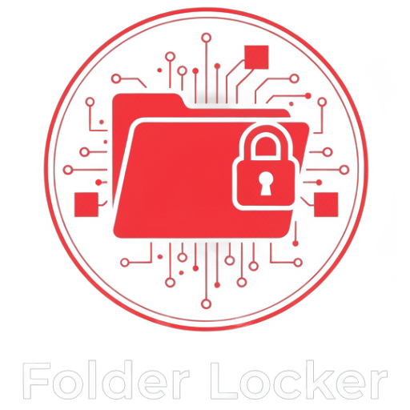

# `>_` FolderLocker Security Suite

**Suite de Seguridad "Zero-Knowledge" de Grado Empresarial para Windows. Virtualiza, bloquea y desaparece tus archivos.**

 

| 🛡️ | **Estado** | **Descripción y Novedades** |
| :---: | :--- | :--- |
| **v5.2** | 🚀 **Nueva** | *Actualización Integral de Seguridad y Arquitectura:*   • **Auto-Lock por Inactividad** (1 a 30 min + bloqueo de Windows Win+L).   • **Búsqueda en Tiempo Real** con atajos de teclado en "Abrir Bóveda".   • **Filtro Inteligente de Basura** (`thumbs.db`, temporales, locks de Office).   • **Pausar, Reanudar y Cancelar** cifrados gigantes con Two-Phase Commit.   • **Capa de Servicios Desacoplada y Auditoría Forense** (`security.log`).    

<strong>✨ Clic para ver Novedades v5.2</strong>
 <b>🛡️ Auto-Lock & Privacidad</b><ul><li><b>Inactividad Configurable:</b> Bloqueo automático de sesión tras 1 a 30 minutos sin actividad.</li><li><b>Detección de Bloqueo de Windows:</b> Desmontaje inmediato de unidades virtuales al bloquear el PC (Win + L).</li><li><b>Protección de Procesos:</b> Si hay un cifrado en curso, el bloqueo se pospone de forma segura hasta terminar.</li></ul><b>🔍 Buscador Reactivo</b><ul><li>Filtrado instantáneo insensible a mayúsculas por nombre o ruta.</li><li>Navegación fluida por teclado (↓ para navegar, Esc para limpiar, Enter para ir a contraseña).</li></ul><b>🧹 Limpieza & Control de Cifrado</b><ul><li>Exclusión proactiva de archivos temporales (`thumbs.db`, `desktop.ini`, `~$*.docx`, `.tmp`).</li><li>Botones de Pausa (0% CPU), Reanudar y Cancelar Atómico sin riesgo de corrupción.</li><li>Bitácora de auditoría segura (`security.log`) con rotación automática a 5 MB.</li><li>Capa de servicios desacoplada con 36 pruebas unitarias automatizadas (100% PASS).</li></ul>
 |
| **v5.1** | ✅ **Estable** | *Ahora con "Atomic Locking" (Blindaje contra Apagones).* |
| **v5.0** | 📦 **Legacy** | *Arquitectura "Stealth" e Integración Nativa con Dokan Driver.* |

 

    

---

    
Desplegar Tabla de Contenidos

    
 
        
- [`>_` FolderLocker Security Suite](#_-folderlocker-security-suite)
  - [`>_` Propósito](#_-propósito)
  - [`>_` 🎥 Demos en Vivo](#_--demos-en-vivo)
  - [`>_` 📱 Galería de Pantallas](#_--galería-de-pantallas)
  - 
  - [`>_` ⬇️ Descarga](#_-️-descarga)
  - [`>_` Características](#_-características)
    - [Próximas Funciones:](#próximas-funciones)
  - [`>_` Arquitectura](#_-arquitectura)
  - [`>_` Instalación](#_-instalación)
  - [`>_` ❓ Solución de Problemas (FAQ)](#_--solución-de-problemas-faq)
  - [`>_` Contribuciones](#_-contribuciones)
    - [`>_` Cómo Contribuir](#_-cómo-contribuir)
  - [`>_` 🙌 Créditos y Desarrollador](#_--créditos-y-desarrollador)
    - [`>_` ⚖️ Aviso Legal (Disclaimer)](#_-️-aviso-legal-disclaimer)

---

## `>_` Propósito

FolderLocker ha sido desarrollado con el objetivo de proporcionar una herramienta potente y centrada en la **privacidad absoluta** para usuarios de Windows. A diferencia de los ocultadores de carpetas tradicionales (que solo cambian atributos), esta suite utiliza un **Driver de Sistema de Archivos Virtual (Dokan)** para encriptar los datos al vuelo.

Esta aplicación está diseñada para **seguridad real**. Si la bóveda no está montada, tus archivos son matemáticamente inaccesibles e invisibles en el disco físico.

**Casos de Uso Principales:**
- **Privacidad Personal:** Mantén fotos, documentos y videos lejos de miradas indiscretas.
- **Transporte de Datos:** Crea bóvedas portátiles que solo se pueden abrir con tus credenciales.
- **Protección Antirrobo:** Incluso si roban tu disco duro, los nombres de archivos y contenidos permanecen ofuscados (GUIDs ilegibles).

> [!Caution]
> **Aviso de Pérdida de Datos:**  
> FolderLocker utiliza encriptación AES-256 y SHA-256 de grado militar. Si pierdes tu Contraseña Maestra Y tu Código de Recuperación, **tus datos se perderán matemáticamente para siempre**. No existen "puertas traseras" (backdoors).

---

## `>_` 🎥 Demos en Vivo

¡Mira FolderLocker en acción!

  <table>
    <tr>
      <td align="center">
        <strong>🔒 Protección Instantánea</strong> 
        <em>Arrastrar, soltar y bloquear en segundos.</em>  
        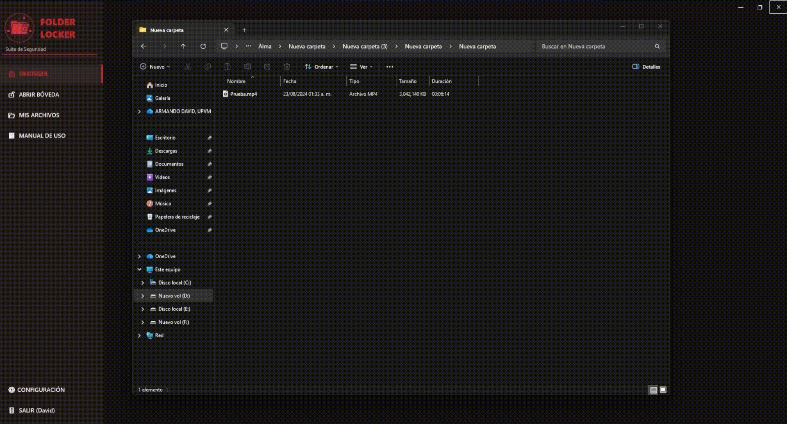
      </td>
      <td align="center">
        <strong>📂 Montaje de Unidad Virtual</strong> 
        <em>Acceso transparente a archivos encriptados.</em>  
        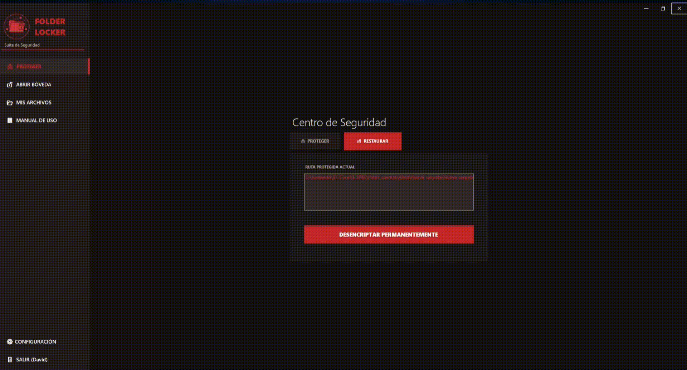
      </td>
    </tr>
  </table>
  
   
  
  

    
<strong>Ver más demostraciones (Desencriptar)</strong>

     
    

        <strong>🔓 Proceso de Restauración</strong> 
        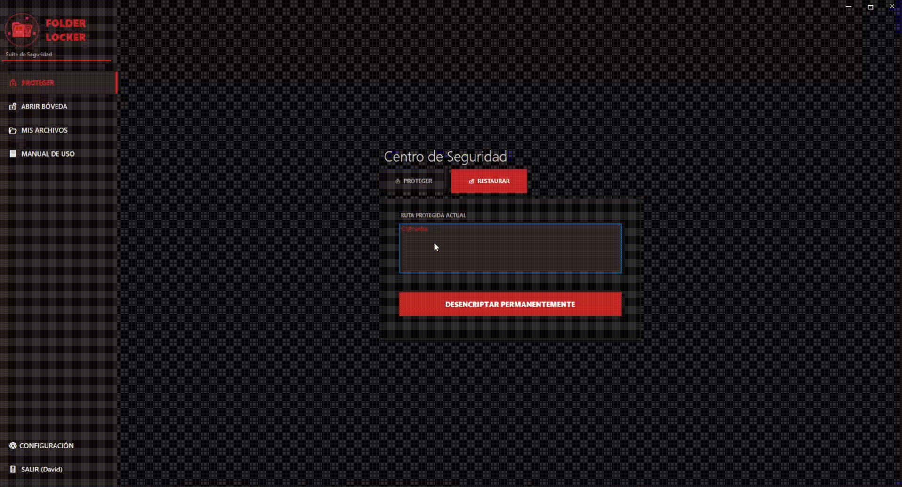
    

  

---

## `>_` 📱 Galería de Pantallas

Explora cada rincón de la interfaz **Red Security**:

     
    <table>
        <tr>
            <td align="center" width="50%">
                <strong>Inicio de Sesión Seguro</strong> 
                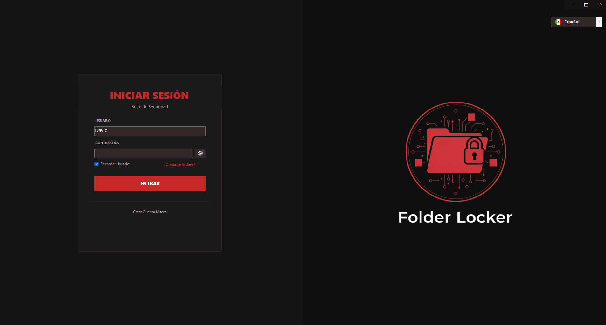
            </td>
            <td align="center" width="50%">
                <strong>Registro de Usuario</strong> 
                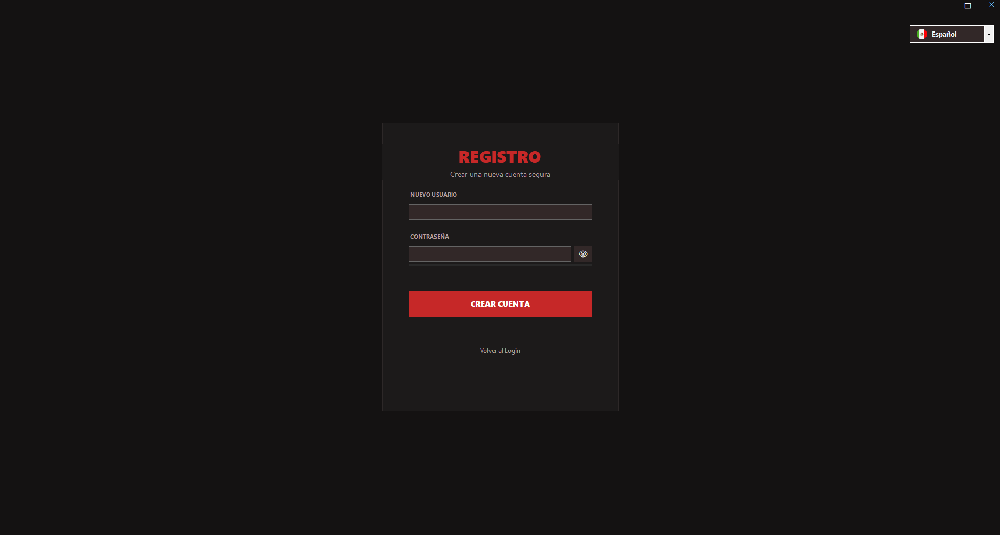
            </td>
        </tr>
        <tr>
            <td align="center" width="50%"> <strong>Dashboard Principal</strong> 
                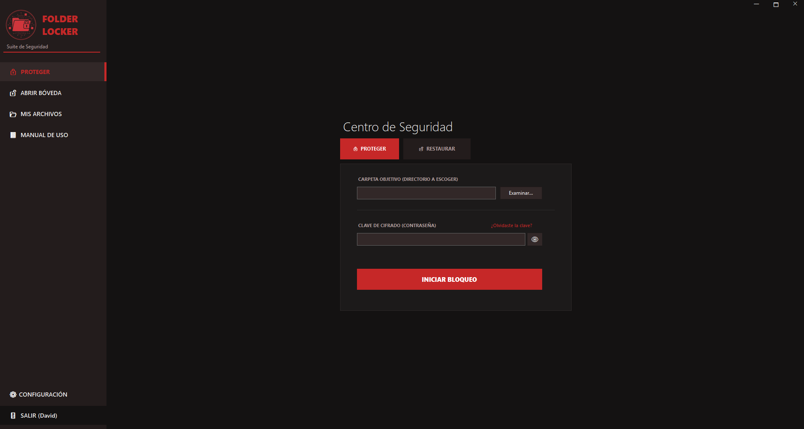
            </td>
            <td align="center" width="50%">
                <strong>Explorador Virtual (M:)</strong> 
                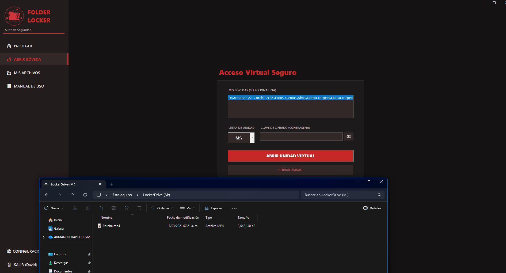
            </td>
        </tr>
        <tr>
            <td align="center" width="50%">
                <strong>Procesamiento en Tiempo Real</strong> 
                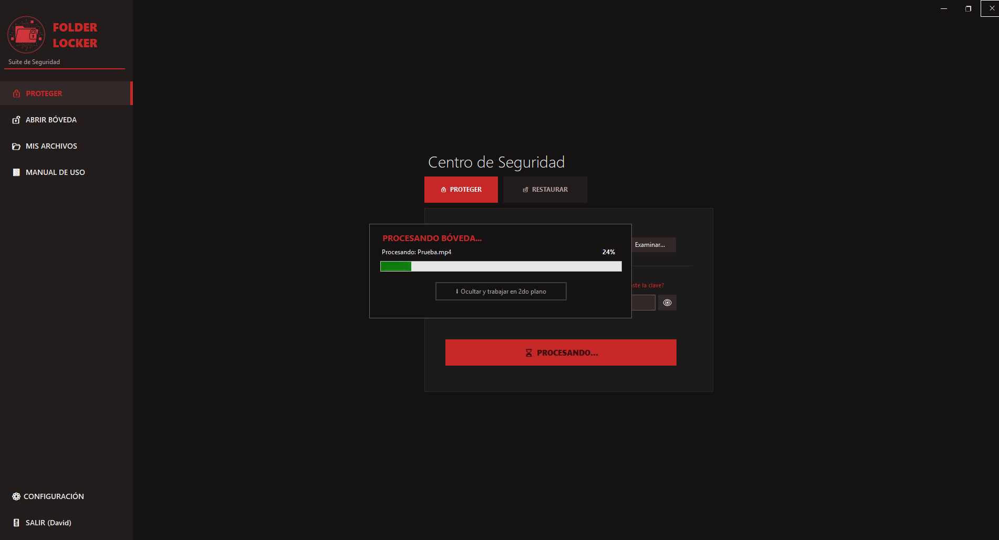
            </td>
            <td align="center" width="50%">
                <strong>Manual de Usuario Integrado</strong> 
                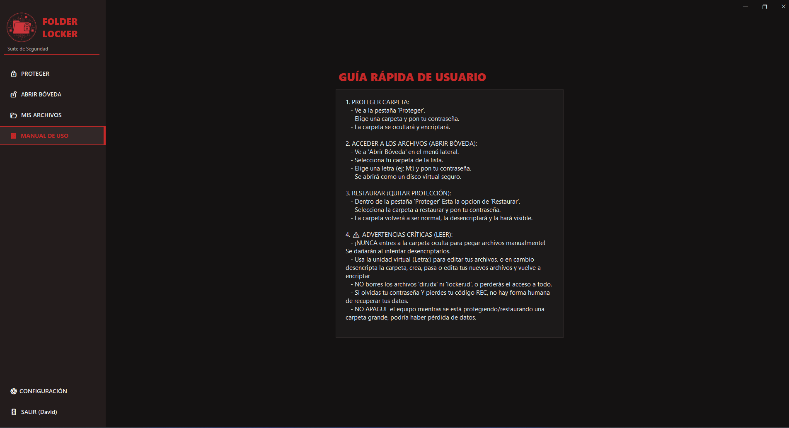
            </td>
        </tr>
        <tr>
            <td align="center" width="50%">
                <strong>Configuración y Ajustes</strong> 
                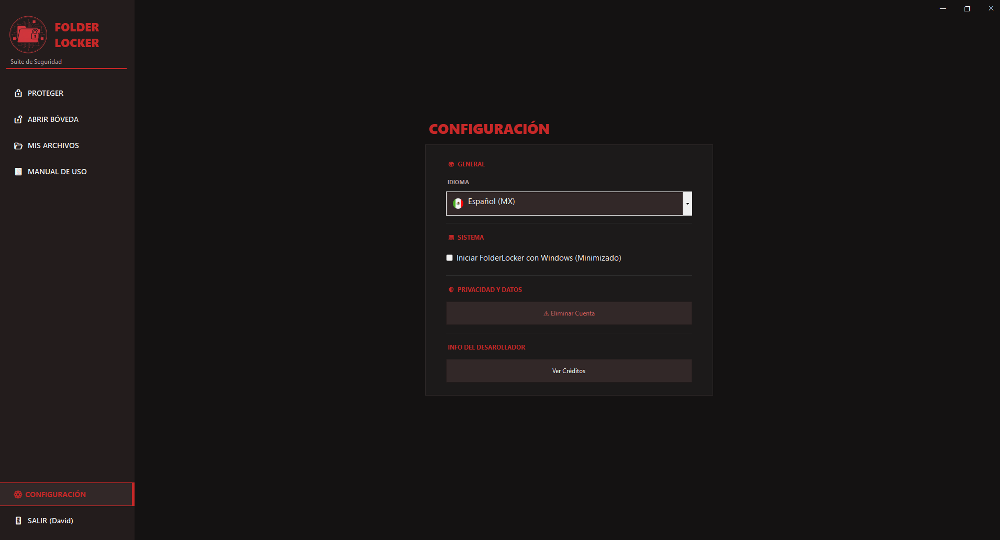
            </td>
            <td align="center" width="50%">
                <strong>Modo Sigiloso (System Tray)</strong> 
                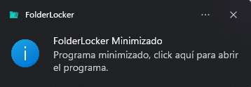
            </td>
        </tr>
    </table>
     

---

## `>_` ⬇️ Descarga

Descarga el último archivo `installer.exe` directamente desde la página de lanzamientos (Releases):

  

---

## `>_` Características

- **Auto-Lock por Inactividad:** Cierre de sesión automático configurable (1 a 30 min) y desmontaje preventivo de unidades virtuales Dokan al alejarse del equipo o presionar `Win + L`.
- **Búsqueda Predictiva en Tiempo Real:** Filtrado reactivo en "Abrir Bóveda" por nombre o ruta, con navegación ágil por teclado (`↓`, `Esc`, `Enter`) y contador dinámico de resultados.
- **Filtro Inteligente de Basura:** Detección y omisión proactiva de archivos del sistema y temporales (`thumbs.db`, `desktop.ini`, `~$*.docx`, `.tmp`), con tarjeta de activación/desactivación en Configuración.
- **Pausa, Reanudación y Cancelación Atómica:** Control total sobre operaciones pesadas de cifrado. Pausa con 0% de CPU y cancelación atómica que purga temporales sin riesgo de corrupción.
- **Registro de Auditoría Forense (`security.log`):** Bitácora local de eventos de seguridad con rotación automática a 5 MB que registra accesos, montajes, bloqueos y modificaciones.
- **Capa de Servicios Desacoplada:** Arquitectura modular (`IVaultService`, `IFolderProtectionService`, `IInactivityService`) respaldada por una suite de 36 pruebas unitarias automatizadas (100% PASS).
- **Arquitectura "Stealth":** Los nombres de archivo se ofuscan en el disco físico (se convierten en GUIDs aleatorios).
- **Encriptación On-The-Fly:** Los archivos se descifran en la memoria RAM solo cuando los solicitas. Nada se guarda en texto plano.
- **Interfaz Moderna UI:** Diseño limpio "Red Security" inspirado en dashboards de ciberseguridad, sin bordes.
- **Unidad Virtual (M:):** Monta tu bóveda como una unidad extraíble real en "Este Equipo".
- **Base de Datos Multi-Usuario:** Archivo `users.db` encriptado que soporta múltiples cuentas aisladas en la misma PC.
- **Smart Drag & Drop:** Protege carpetas al instante simplemente arrastrándolas a la aplicación.
- **Bloqueo Automático:** Las bóvedas se desmontan automáticamente al cerrar la aplicación.
- **System Tray:** Funciona silenciosamente en segundo plano con notificaciones no intrusivas.
- **Fail-Safe:** Sistema transaccional de base de datos para prevenir corrupción durante cortes de energía.
- **Soporte Multi-Lenguaje:** Interfaz traducida nativamente a **Español 🇪🇸, Inglés 🇺🇸, Portugués 🇧🇷, Ruso 🇷🇺 y Chino 🇨🇳**.

### Próximas Funciones:

- **Sincronización en Nube:** Auto-subida encriptada a Google Drive / OneDrive.
- **Login Biométrico:** Integración con Windows Hello (Huella/Rostro).
- **Botón de Pánico:** Atajo de teclado global para desmontar todo instantáneamente.
- **Modo Portable:** Ejecutar directamente desde una USB sin instalación.

---

## `>_` Arquitectura

Este proyecto está construido utilizando tecnologías .NET de vanguardia y arquitectura desacoplada:

| Componente | Stack Tecnológico | Descripción |
| :--- | :--- | :--- |
| **Core** | C# .NET 8.0 | Framework de escritorio de alto rendimiento. |
| **Kernel** | DokanNet 2.3.0 | Wrapper para el driver de sistema de archivos en modo usuario. |
| **Criptografía** | AES-256 CTR + SHA256 | Hashing con "Salt" y cifrado de flujo seguro por bloques. |
| **Protección Atómica** | Two-Phase Commit | Transaccionalidad a prueba de fallos de energía con saneamiento de temporales. |
| **Seguridad Activa** | InactivityService | Monitoreo de inactividad por hardware (IMessageFilter) y bloqueo de Windows. |
| **Auditoría** | SecurityAuditLogger | Registro rotativo a 5 MB para trazabilidad forense local. |
| **Testing** | xUnit (.NET 8) | Suite de 36 pruebas unitarias automatizadas (100% PASS). |
| **Datos** | JSON + Ofuscación | Almacenamiento local seguro para perfiles de usuario. |

---

## `>_` Instalación

1.  Descarga el instalador oficial `FolderLocker Setup v5.2.exe`.
2.  Ejecuta el instalador.
    * *Detección Inteligente:* El instalador detectará automáticamente si necesitas el **Driver Dokan**. Si te falta, lo instalará silenciosamente.
    * *Desinstalación Limpia:* Incluye desinstalador completo con acceso directo en el Menú Inicio y registrado en *Configuración de Windows > Aplicaciones instaladas*.
3.  Reinicia tu PC (si se instalaron los drivers por primera vez).
4.  Inicia **FolderLocker** desde tu escritorio.

---

## `>_` ❓ Solución de Problemas (FAQ)

**P: Veo archivos con extensión `.lock` y nombres raros en mi disco físico (C:). ¿Qué hago?**
> **R:** **¡No los toques ni los borres!** Esos son tus archivos protegidos por la tecnología *Stealth*. Para verlos y editarlos correctamente, abre FolderLocker, selecciona la carpeta y pulsa **"Abrir Bóveda"**. Se montarán automáticamente en la unidad virtual `M:` con sus nombres y formatos originales.

**P: Olvidé mi contraseña maestra.**
> **R:** Utiliza el botón *"¿Olvidaste la clave?"* en la pantalla de inicio e introduce tu código `REC-XXXX` que se generó al crear la cuenta. **Nota Importante:** Si pierdes tanto la contraseña como el código de recuperación, la encriptación AES-256 hace matemáticamente imposible recuperar los datos.

**P: El programa no inicia o da error al montar la unidad.**
> **R:** Asegúrate de que no hayas desinstalado el controlador **Dokan Library** (o Dokan file system driver) desde el Panel de Control. FolderLocker necesita este componente esencial para virtualizar el disco encriptado.

---

## `>_` Contribuciones

¡Las contribuciones son bienvenidas! Ya sea reportando bugs, mejorando la documentación o sugiriendo nuevas funciones.

### `>_` Cómo Contribuir
1. **Revisar Issues**: Busca en los [problemas abiertos](https://github.com/DeathSilencer/FolderLocker-Security-Suite/issues) para ver dónde puedes ayudar.
2. **Fork del Repo**: Haz un "Fork" del repositorio para tener tu propia copia y realizar cambios.
3. **Enviar un PR**: Crea un *Pull Request* con una descripción clara de tus mejoras.

---

## `>_` 🙌 Créditos y Desarrollador

- 👨‍💻 Desarrollado con ❤️ y mucho ☕ por **David Platas**
- 🛡️ Impulsado por el proyecto **Dokan Library**.
- 🎨 Iconos de UI por **Icons8** y **Flaticon**.

  

 

### `>_` ⚖️ Aviso Legal (Disclaimer)

> [!Warning]
> **Renuncia de Responsabilidad:**  
> Este software se proporciona "tal cual", sin garantía de ningún tipo, expresa o implícita. El desarrollador no se hace responsable de ninguna pérdida de datos, corrupción de archivos o daños derivados del uso (o mal uso) de esta herramienta. **La seguridad de tus datos es tu responsabilidad:** realiza copias de seguridad de tu Código de Recuperación y nunca manipules los archivos ocultos manualmente fuera de la aplicación.
> 
